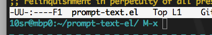

prompt-text-el
==============

Configure your Minibuffer Prompt

Overview
--------

`prompt-text` provides a feature to print additional information
always when Emacs asks you something in minibuffer.

By default the text includes your login name, hostname and current working
directory.
For example, when you type `M-x`, Emacs will show a prompt like:

    10sr@mbp0:~/prompt-text-el M-x

Enable global minor-mode `prompt-text-mode` to start using.

You can set `prompt-text-format` to change the text to print.
This value will be formatted with `format-mode-line`: see docstring of
`mode-line-format` for available expressions.

License
-------

This software is released under Unlicense.
